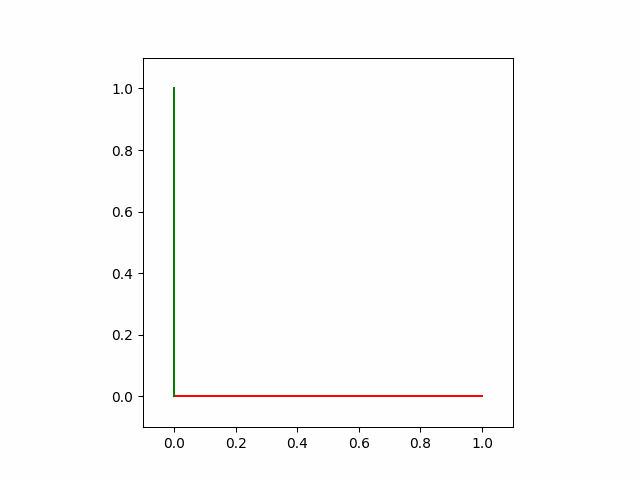

# Boiler plate animation

## Plotting
- matplotlib
    - pyplot.plot
    - FuncAnimation: Draw the frames in the animation
    - PillowWrite: Export the animation as .gif file 

## Linear Algebra
- NumPy
    - linalg.norm
    - linalg.dot
    - array
    - sin, cos

