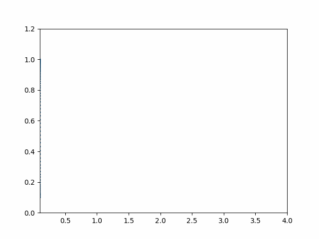

# Difference Equations

$$ x_{n+1} = f(x_n) $$

## Ricker Model

$$ f(x) = xe^{r(1-x/k)} $$

Varying the parameter r.

**Plot of Ricker against parameter**

**Plot of Ricker against time**

**Cobweb Diagram**
